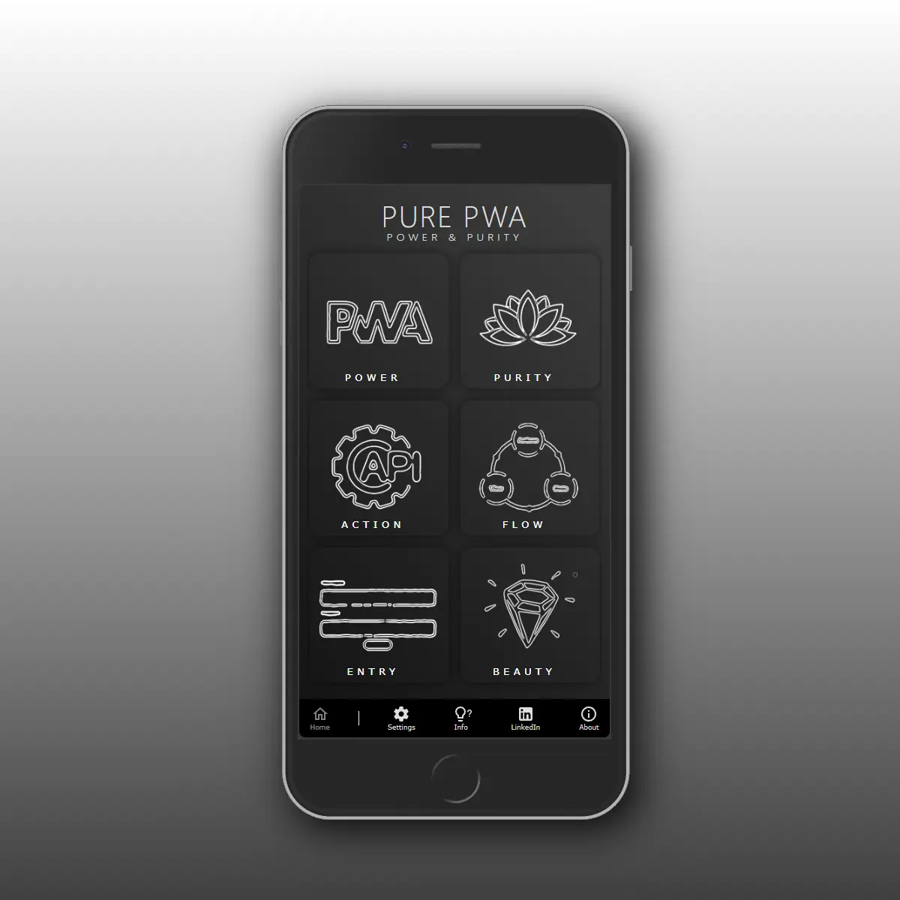
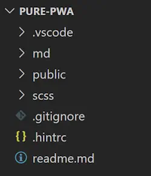
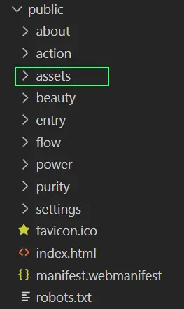
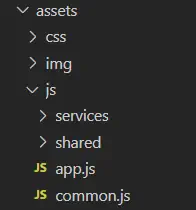
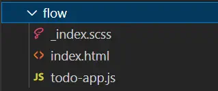

# PurePWA - Power & Purity

> PurePWA is a **Radical Experiment** in Simplifying Boilerplate for PWAs, in which we force ourselves to only use the **Modern Web** standards, and nothing else.



# Table of Contents

- [Setup](#Setup)
- [Project Structure](#Project_Structure)
- [Usage](#usage)
- [New in](#New_In)
- [More Info](#more_info)

# Setup

> There is no setup.

💡 This is a vanilla, accessible, SEO-friendly, ultra-lean, no-build, no dependencies `PWA` project, using only what's included in the Web Standards and has been implemented by Modern Browsers.

The two most important technologies used are:

- Web Components
- ES Modules (loaded and linked at runtime)

## Tooling

I have developed the code using these tools:

- Microsoft VSCode
  - VSCode extensions:
    - ritwickdey.LiveServer (Easy to use built-in web server)
    - glenn2223.live-sass (Live SCSS compilation)
    - PWABuilder.pwa-studio (optional - Loads of PWA goodies)

Using the tools mentioned above, the PWA is directly served using `LiveServer`, and CSS is compiled from `.scss` files by `live-sass`.

**Nothing else is needed.**

# Project Structure



## Web Root: `public/`

This is a `hybrid MPA`, which means that we have multiple app pages, each one in its own folder.

This provides a number of undeniable benefits:

- No need for SPA routing 🤯
- Code readability and maintenance
- Smaller, optimized downloads,

Although base routing is handled by the web server, each route can still setup sub-routes and handle them, through a web standards-based routing mechanism ([Navigator.navigate](https://developer.mozilla.org/en-US/docs/Web/API/Navigation/navigate)).

The `public/` folder is the one getting served as root (see `.vscode/settings.json`).

Within `public/`, there's one system folder (`assets/`), and a folder for each `MPA` page.



### Assets

The `assets/` folder holds shared images, css (compiled from `/scss/app.scss` and its `@import`-ed `.scss` files).



The `assets/js/` folder holds:

#### 1. `services`

Service Worker and related

#### 2. `shared`

Web Components (each in a seperate folder)

#### 3. `app.js`

Main entry point

```html
<script defer type="module" src="assets/js/app.js"></script>
```

#### 4. `common.js`

Shared, exported symbols used elsewhere.

```js
import { CustomElement } from "../assets/js/common.js";
```

### MPA Pages

Each MPA Page folder can consist of `HTML`, `SCSS` and `JS` files (and other files that are related to the page).



The `SCSS` files are imported into the `index.scss` file in the public root, and are compiled automatically by the Live Sass Compiler, into `public/assets/css/app.css.

> The '\_' in `_index.scss` means the stylesheet is going to be imported (@import) to a main stylesheet i.e. styles.scss.

This is a choice I made, to have just one CSS file served. Suit yourself if you would like to implement a different approach.

If there is a `.js` file in an app folder (such as in the example), the `index.html` file will include it, like this:

```html
<script defer type="module" src="todo-app.js"></script>
```

The main advantage of this approach is that `MPA` pages are isolated modules, with page-specific behavior just declared for that page.

This means improvement **maintenance**, **readability**, **separation of concerns**, and **deployability**.

## Shared Components

Having separate app pages, in an `MPA` app, doesn't mean that there's no shared code.

### ECMAScript Imports

We rely on the standards-based, `ECMAScript` runtime import mechanism, that is similar to the way imports are done in bundling/building environments (webpack, vite, esbuild, etc.), but uses the `.js` extension:

```js
import { CustomElement } from "../../common.js";
```

## Web Components

PurePWA uses two kinds of Web Componenents:

### 1. Self-contained controls (with Shadow DOM)

These components insert their own content into the `Shadow DOM` below their container element. Styling is then isolated and should be done using [adopted stylesheets](https://developer.mozilla.org/en-US/docs/Web/API/Document/adoptedStyleSheets).

### 2. Progressive Enhancement wrappers (with Light DOM)

These components enhance existing, contained HTML structures, using the `Light DOM`, the content nested within the Web Component's tags. Styling doesn't differ from standard styling in the rest of the document.

### The CustomElement class

This is a generic Web Component class that offers a few benefits over the `HTMLElement` base class:

#### 1. `state` property (managed by a `Proxy` object)

- [More on the `Proxy` class](https://developer.mozilla.org/en-US/docs/Web/JavaScript/Reference/Global_Objects/Proxy)
- [Make your own state management with Proxies and Event emitters](https://dev.to/fly/make-your-own-state-management-for-react-with-proxies-1n0m)

#### 2. `render()` method that mimics framework best practices, but uses `ES String Literals`

```js
render() {
  const builder = new HTMLBuilder(/*html*/ `<ol>{html}</ol>`);

  for (let item of this.listViewItems) {
    builder.add(this.getItem(item));
  }
  return builder.toHTML();
}
```

### The RouterElement class

Inherits from `CustomElement`. Provides simple 'SPA'-like routing, but within the `MPA` page.

Instead of the `render()` method of the `CustomElement` class, you use the `routes` property to implement your rendering logic:

Example:

```js
  get routes() {
    return {
      "/movies/": this.getPopularMovies.bind(this),
      "/movie/": this.getMovie.bind(this)
    };
  }

  async getPopularMovies() {
    hookEscapeKey(() => history.back());

    const movies = await this.tmdb.getPopularMovies();

    return /*html*/ `<section class="cards" >${this.getCards(
      movies.results
    )}</section>`;
  }
```

# Native Look & Feel

One of the goals of the `PurePWA` experiment is getting a **near-native** experience. But to get that, we first need to get a grasp of what that actually means.

- Glossy appearance (scalable vector graphics, gradients, shadows)
- Download/launch/interaction speed
- Optimal device real estate usage
- Responsive, mobile-first design
- Offline capability
- No HTML reflows during app usage
- Micro-animations: subtle effects to give immediate feedback, more user satisfaction and engagemen, create fluid state transitions, and even prevent errors (because of immediate feedback).
- No browser chrome (PWAs run in the browser, but you want to hide all browser UI)

This project tries to address all of these areas.

## SVG Sprites

For PurePWA, I've chosen the very much undervalued `SVG Sprites` technique for icons and other graphics.

Check out this [free store for more icons](https://materialdesignicons.com/).

```xml
<svg xmlns="http://www.w3.org/2000/svg">
  <defs>
    <symbol id="menu"
      xmlns="http://www.w3.org/2000/svg">
      <path d="M3,6H21V8H3V6M3,11H21V13H3V11M3,16H21V18H3V16Z" />
    </symbol>

    <symbol id="blog"
      xmlns="http://www.w3.org/2000/svg">
      <path d="M4,5H20V7H4V5M4,9H20V11H4V9M4,13H20V15H4V13M4,17H14V19H4V17Z" />
    </symbol>
  </defs>

  <!-- more -->
</svg>
```

The `svg-icon` Web Component is used to include graphics within the HTML structure.

```html
<a href="/" aria-label="Home">
  <svg-icon icon="home" color></svg-icon>
  <span>Home</span>
</a>
```

The `svg-icon` component sits in the `/public/assets/js/shared` folder.

```js
import { CustomElement } from "../../common.js";

customElements.define(
  "svg-icon",
  /**
   * Renders SVG icon using SVG sprites defined in /assets/img/icons.svg
   */
  class SVGIcon extends CustomElement {
    static get observedAttributes() {
      return ["icon"];
    }

    attributeChangedCallback(name, oldValue, newValue) {
      if (name === "icon" && newValue) {
        this.querySelector("use")?.setAttribute(
          "href",
          "/assets/img/icons.svg#" + newValue
        );
      }
    }

    render() {
      return /*html*/ `<svg class="icon" xmlns="http://www.w3.org/2000/svg">
        <use id="use" href="/assets/img/icons.svg#${this.getAttribute(
          "icon"
        )}" />
      </svg>`;
    }
  }
);
```

# Showcased Technologies

## General

- Auto adapting app menu (hamburger, bottom menu on mobile)
- CSS grid auto flow
- SVG sprite icons
- Micro animations (and consideration of user preferences)
- Light & Dark modes (defaults to system settings)
- Automatic caching of MPA pages (to minimize delays/page loads)
- Skeleton Empty States

## MPA Demo Pages

On each of the demo pages, there's a lot of stuff going on, but all of it is done with pure HTML, CSS and JS, and without any dependencies.

Here are some highlights:

### Power

- Peer-to-peer video calls using WebRTC API
- Web Share API

### Purity

- Accordion using details/summary semantic HTML tags
- Progressive enhancement (accordion-details Web Component)

### Action

- Use of `fetch()` API
- In-page router using `Navigator.navigate` interception
- View Transition API: morphing between master & detail
- Custom Skeleton Empty State

### Flow

- Semantically correct, accessible web form
- Enclosing label inputs to avoid unique ids and 'for' attributes
- x-form progressive enhancement Web Component

### Entry

- Great accessibility
- Semantic HTML (fieldset, legend, label, aria-attributes)
- Progressive enhancement dropdown-list (using input + dynamic datalist)
- CSS-based required field indication
- Powerful HTML5 Form Validation API

### Beauty

- Scrollbar Snap Behavior (scroll-snap-\*)
- View Transitions
- SPA sub-routes

# Development Experience

Did you notice?

- No `node_modules/`
- No `package.json`
- No build time

# Localization

PurePWA supports localization (introduced in version `0.1.0`).

The `/public/assets/js/app-settings.js` file's `APP_SETTINGS.localization` hosts localized strings

```js
localization: {
    defaultLanguage: "en",
    strings: {
      "Power & Purity": {
        nl: "Kracht & Puurheid"
      },
      Power: {
        nl: "Kracht"
      },
      Purity: {
        nl: "Puurheid"
      },
      [...]
```

To accomodate for larger, localized sections (which are handy for localized HTML blocks), there's a `<localize-section></localize-section>` Web Component :

```html
<localize-section url="about.html">
  <p>
    <em>PurePWA</em> is an experiment by
    <a
      rel="noopener"
      target="_blank"
      href="https://www.linkedin.com/in/mvneerven/"
      >Marc van Neerven</a
    >, a Fractional CTO with a passion for the <em>Modern Web</em>
  </p>

  <p>
    The aim was to <em>simplify boilerplate for PWAs</em>, while just using the
    <em>Modern Web</em>, and nothing else.
  </p>

  <p>
    The Modern Web is a beautiful place, but many Web Developers seem to missed
    that, with the 'framework path' being what everybody gets taught.
  </p>
</localize-section>
```

The `url` attribute refers to a file under `/public/assets/locale/<2-letter-language-code>/`. You can see a few examples of these HTML block files under `/public/assets/locale/nl/`

## Localization Under the Hood

Since a lot of PurePWA uses Progressive Enhancement, we had to come up with an easy way to localize-in-place. This is quite different from a Framework app that generates UI from code, like React, Angular of Vue.

We use the `Document.createNodeIterator()` method together with a custom Node Filtering to make very efficient `#text` node changes based on our localization strings.

```js
const textFilter = (node) => {
  return node.nodeType === Node.TEXT_NODE
    ? NodeFilter.FILTER_ACCEPT
    : NodeFilter.FILTER_SKIP;
};

const iterator = document.createNodeIterator(
  document.body,
  NodeFilter.SHOW_TEXT,
  textFilter
);
let node = iterator.nextNode();

while (node) {
  // translate
  node = iterator.nextNode();
}
```

# Releasing a PWA version

## App name, version and file List (ServiceWorker)

Since the PWA has a ServiceWorker that caches the app files, the array of application files needs to be in `service-worker.js`:

```js
const app = {
  name: "pure-pwa",
  version: "0.1.0",
  files: [
    "/about/index.html",
    "/action/domain/tmdb.js",
    "/action/index.html",
    "/action/movies-api.js",
    "/assets/css/app.css",
    "/assets/css/app.css.map",
    [...]
```

To update this array (if needed), you can run the PowerShell file in the project root:

```powershell
.\update_cache_files.ps1
```

Since the project doesn't have bundling and NPM, this was an easy way to get the file list updated.

The .ps1 file updates `/public/assets/js/services/app-files.json`, and before deploying, I manually copy the array contents to the `service-worker.js` `app.files` array.

Before deploying to your cloud location, don't forget to update app.name (first deploy) & app.version (every deploy). These are used in the ServiceWorker code to refresh the cache.


# Stripping Down to Boilerplate

`/public/assets/js/app.js` contains a few lines that add the demo pages and some other demo-related stuff to the project:

```js
import { mergeDeep, PurePWA } from "./common.js";
import { APP_SETTINGS } from "./app-settings.js";
import { DEMO_SETTINGS } from "./demo-settings.js";

/**
 * TO REMOVE THE DEMO, CHANGE THE NEXT 2 LINES INTO THIS:
 * let appSettings = APP_SETTINGS;
 */
const appSettings = {}; // APP_SETTINGS
mergeDeep(appSettings, APP_SETTINGS, DEMO_SETTINGS);

window.purePWA = new PurePWA(appSettings); // Launch main PWA controlling component

if (typeof navigator.serviceWorker !== "undefined")
  navigator.serviceWorker.register("/assets/js/services/sw.js");
```

Creating pure boilerplate thus comes down to changing the code:

```js
import { mergeDeep, PurePWA } from "./common.js";
import { APP_SETTINGS } from "./app-settings.js";

window.purePWA = new PurePWA(APP_SETTINGS); // Launch main PWA controlling component

if (typeof navigator.serviceWorker !== "undefined")
  navigator.serviceWorker.register("/assets/js/services/sw.js");
```

Of course, you'll then remove the `about`, `purity`, `flow`, `entry`, `action` and `power` folders and adapt the `routes` property in `/public/assets/js.app-settings`.

# New In

## 0.1.0

- Added a custom Splash screen (all other pages, including `/home/`, are now in their own folder)
- Added support for Localization (see Localization). 
- Fixed `<header>` HTML semantics

# More Info

If you want to follow further developments of the `PurePWA` project, follow this repo, and these other sources:

## Blogs

- [PurePWA: Power &amp; Purity](https://medium.com/javascript-in-plain-english/embracing-the-beauty-of-the-standards-in-2023-web-development-29dbeece2966)

## LinkedIn

Follow the [#purepwa](https://www.linkedin.com/feed/hashtag/?keywords=purepwa) hashtag.
